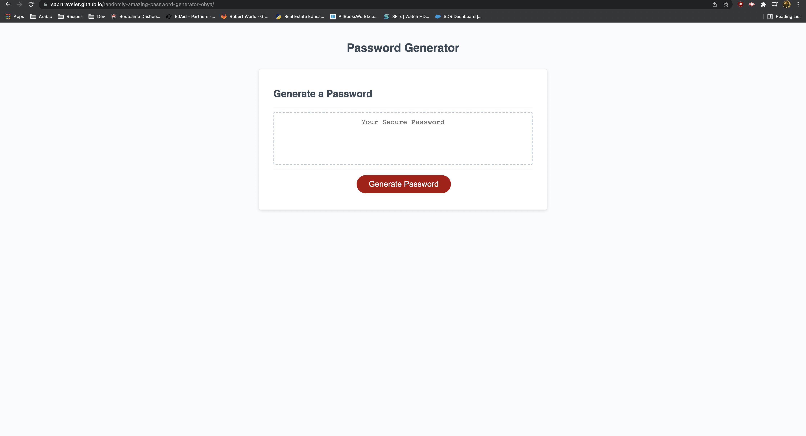

# Password Generator Starter Code

This challenge of the bootcamp was to create a random password generator that an employee can use based on criteria selected.  
Thee password generator checks for the following criteria:  
<li>Makes sure the length of the password is between 8-128 characters. 
<li>Gives the user to choose either lowercase, uppercase, numerical and/or special characters.  
<li>The program alerts the user if they have not picked atleast one character type. 
<li>This project was great practice to learn javascript basics like creating variables, if statements and different types of loops.  
<li>Included comments in the .js file to be clear in what we are trying to accomplish in the code.  
The following images shows the web application's appearance and functionality:   
  

Link to deployment: https://sabrtraveler.github.io/My-first-refactor-completed-ohyeah/
